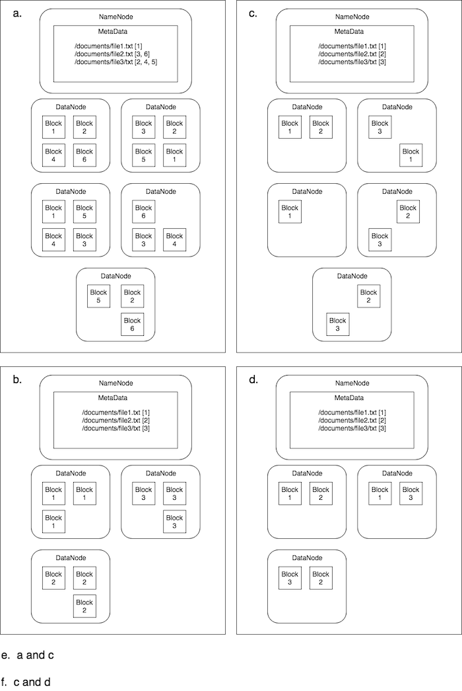

## Assignment 2: Hadoop

### Question 1 (6 Marks)
A colleague has suggested using Hadoop to build a banking system for tracking customers' deposits.  Give three good reasons why this is a *very bad* idea.

**Answer:**
- Hadoop was made for reporting large amount of data, not for quick writing transactional data.
- Data may be not always consistent, which is a big problem for banking systems.
- Also Hadoop can have some latency, which is not apropiate for banking systems.


### Question 2 (6 Marks)
Your colleague was impressed by your arguments above and has come to seek your counsel on another matter. He has heard that graph databases are really cool and wants to know if an analytics system his department has should use graph databases as its datastore. Give three good questions you could ask to assess whether a graph database would be an appropriate technology for your associate's application.

**Answer:**
- Does your data have an object-oriented model?
- Does those objects highly related to each other?
- Does this relationships change very frequently?


### Question 3 (6 Marks)
Your reputation is spreading.  A department head wants to know if they should switch from a relational database management system to a column-oriented one such as HBase.  What are three questions you could ask to help determine if one is better suited than the other?

**Answer:**
 - Do you add a large amount of transactions to the database every day?
 - Is the database will be used for analytical purposes?
 - Does the data has a lot of redundancy in the columns?

### Question  4 (6 Marks)
A friend is now asking about whether MongoDB would be a good choice for a datastore for a customer relationship management system they're planning to build. Again, what are three questions you could ask to assess if MongoDB would be suited for their use cases? .

**Answer:**
- Does your data comes in a semi-structured format?
- Do you need the capacity to scale?
- How important is consistency across the database?


### Question 5 (2 Marks)
Whenever you have replicated data it is impossible to keep the copies exactly synchronized.  Why is this difficult and why is this a problem?

**Answer:**

If new data is being stored, it would be impractical to try to lock all the replicas for updates simultaneously. This would kill the performance gains we're looking to achieve to serve Internet-scale applications. An eventual consistency model has been adopted where a change made in one of the replicas will be duplicated to the other copies across the system over a short but non-zero time. As a result, these databases are more focused on making the data available and less focused on making the data consistent.

### Question 6 (2 Marks)

Which diagram(s) best illustrates a HDFS cluster configuration that has a replication factor of 3 for 3 files.



### Question 7 (2 Marks)

Consider the following input text that contains part of a poem called The Love Song of J. Alfred Prufrock BY T. S. ELIOT:
```
Time for you and time for me,
And time yet for a hundred indecisions,
And for a hundred visions and revisions,
Before the taking of a toast and tea.
```
Let’s say we want a word count of this file by creating a MapReduce application.  We would split this file into the following four input pairs to four Mapper tasks to consume.
```
(0, "time for you and time for me") 
(1, "and time yet for a hundred indecisions ")
(2, "and for a hundred visions and revisions") 
(3, "before the taking of a toast and tea")
```
What will the input pairs look like for the Reducer tasks?  Assume that combiner tasks are used in the MapReduce application.

a.
```
(time, [1, 1, 1])
(for, [1, 1, 1, 1])
(you, [1])
(and, [1, 1, 1, 1])
(me, [1])
(yet, [1])
(a, [1, 1, 1])
(hundred, [1, 1])
(indecisions, [1])
(visions, [1])
(revisions, [1])
(before, [1])
(the, [1])
(taking, [1])
(of, [1])
(toast, [1])
(tea, [1])
```
b.
```
(time, 3)
(for, 4)
(you, 1)
(and, 4)
(me, 1)
(yet, 1)
(a, 3)
(hundred, 2)
(indecisions, 1)
(visions, 1)
(revisions, 1)
(before, 1)
(the, 1)
(taking, 1)
(of, 1)
(toast, 1)
(tea, 1)
```
c.
```
(time, [2, 1])
(for, [2, 1, 1])
(you, [1])
(and, [1, 1, 2, 1])
(me, [1])
(yet, [1])
(a, [1, 1, 1])
(hundred, [1, 1])
(indecisions, [1])
(visions, [1])
(revisions, [1])
(before, [1])
(the, [1])
(taking, [1])
(of, [1])
(toast, [1])
(tea, [1])
```
d.	None of the options


#%%


